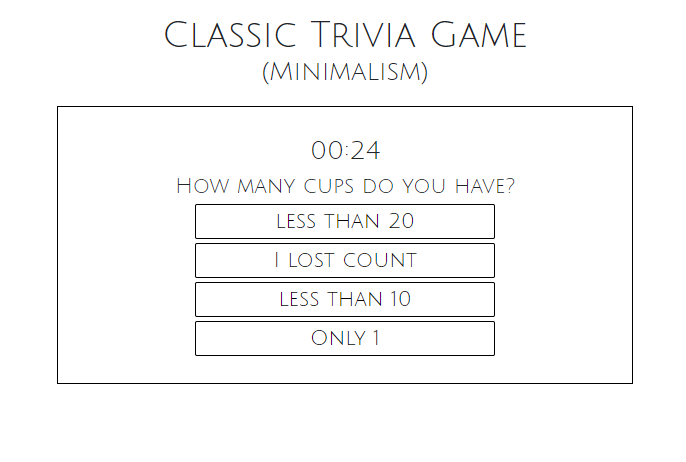

# TriviaGame

This is a classic Trivia Game with a countdown timer. It is a very minimalistic approach to design, trying to achieve a look and and feel of pure contrast. The questions and answers can be adjusted. For the correct answer it will be in the variable "a1" which the program then shuffles around so that it is not in the same spot. 

## Usage

This project was completed using Javascript, JQuery, Bootstrap, HTML, and CSS.

## Contributing
Pull requests are welcome. For major changes, please open an issue first to discuss what you would like to change.

Please make sure to update tests as appropriate.

## License

created by kima111